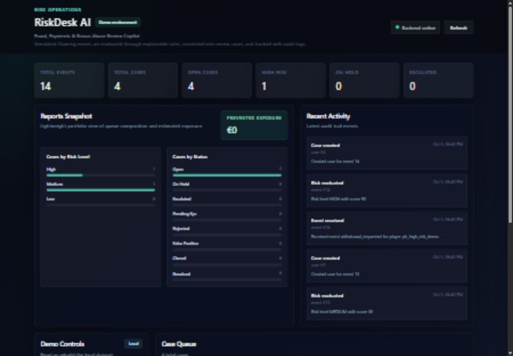
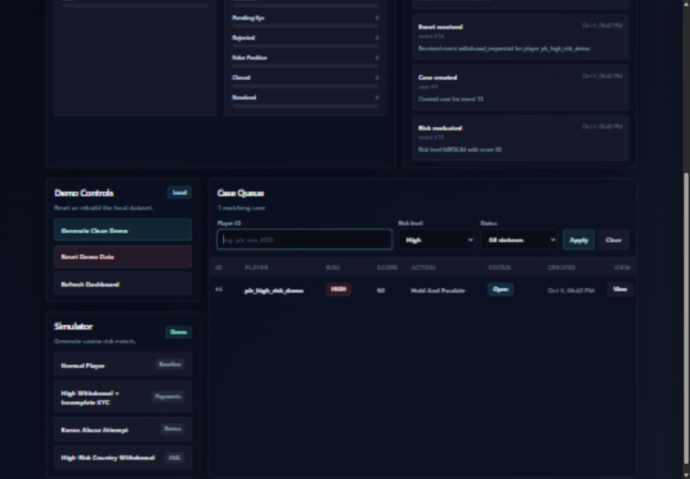
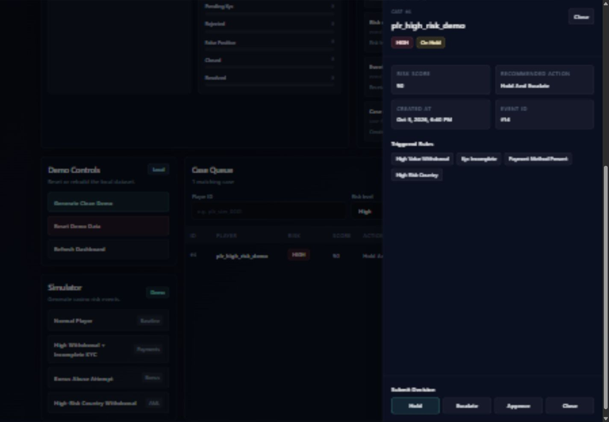

# RiskDesk AI

A local risk-event intake and analyst case-review service with a FastAPI backend and a Vite React dashboard.

## Current Portfolio Upgrade

The portfolio upgrade now includes server-backed queue filters, Python 3.12, PostgreSQL support, Alembic migrations, single-operator access protection, and concurrency-safe case decisions. No cloud service has been provisioned. See the [portfolio upgrade audit](docs/PORTFOLIO_UPGRADE.md), [PostgreSQL deployment foundation](docs/POSTGRES_DEPLOYMENT_FOUNDATION.md), [access and case-transition rules](docs/ACCESS_AND_CASE_TRANSITIONS.md), and [dependency security audit](docs/DEPENDENCY_AUDIT.md) for verified results and remaining limitations.

## Portfolio Screenshots

All names, identifiers, events, amounts, and decisions shown below are synthetic demo data.



*Demo data — dashboard overview with queue health and recent activity.*



*Demo data — server-backed high-risk queue filter.*



*Demo data — case review, triggered rules, and recorded decision state.*

## Backend

The backend is a FastAPI application using SQLAlchemy with PostgreSQL and SQLite support. SQLite remains the zero-service local default; PostgreSQL is the persistent deployment target. Routes are intentionally thin, business logic lives in services, and database access is isolated in repositories. Schema changes are explicit Alembic migrations and are never applied during application startup.

## Local Setup

Run these backend commands from the project root:

```powershell
cd "C:\RiskDesk AI\backend"
py -3.12 -m venv .venv
.\.venv\Scripts\python.exe -m pip install --require-hashes -r requirements.lock
$env:RISKDESK_MIGRATION_DATABASE_URL="sqlite:///./riskdesk_ai.db"
$operator = Get-Credential -UserName "portfolio_operator"
$env:RISKDESK_OPERATOR_USERNAME=$operator.UserName
$env:RISKDESK_OPERATOR_PASSWORD=$operator.GetNetworkCredential().Password
$env:RISKDESK_DEMO_MODE="true" # local synthetic demo only
.\.venv\Scripts\python.exe -m alembic upgrade head
.\.venv\Scripts\python.exe -m pytest
.\.venv\Scripts\python.exe -m ruff check .
.\.venv\Scripts\python.exe -m uvicorn riskdesk_ai.main:app --reload
```

`backend/requirements.txt` is the human-maintained dependency input. `backend/requirements.lock` pins the complete Python 3.12-compatible dependency graph with hashes and is the reproducible install used by CI. Regenerate it after changing the input requirements:

```powershell
cd "C:\RiskDesk AI\backend"
uv pip compile requirements.txt --python-version 3.12 --universal --generate-hashes --output-file requirements.lock
```

Set `RISKDESK_DATABASE_URL` for application traffic and `RISKDESK_MIGRATION_DATABASE_URL` separately for Alembic. Set the operator username and password only through the server environment or its secret store. Do not commit connection strings or credentials. Existing SQLite installations are preserved through a baseline-stamp procedure documented in the [PostgreSQL deployment foundation](docs/POSTGRES_DEPLOYMENT_FOUNDATION.md).

## Frontend

The frontend is a Vite React TypeScript app in `frontend/`. It expects the backend at `http://127.0.0.1:8000` by default.

```powershell
cd "C:\RiskDesk AI\frontend"
npm install
npm run dev
```

Open the local Vite URL shown in the terminal. To point the frontend at a different backend URL, set `VITE_API_BASE_URL`.

```powershell
$env:VITE_API_BASE_URL="http://127.0.0.1:8000"
npm run dev
```

## Simulator

Run a synthetic casino-event scenario through the same ingestion path as the API. This endpoint is available only when `RISKDESK_DEMO_MODE=true`. The following examples assume `$operator = Get-Credential`:

```powershell
Invoke-RestMethod `
  -Method Post `
  -Uri "http://127.0.0.1:8000/api/v1/simulator/run" `
  -Authentication Basic `
  -Credential $operator `
  -ContentType "application/json" `
  -Body '{"scenario":"high_value_withdrawal_incomplete_kyc","player_id":"plr_demo_001"}'
```

Example response:

```json
{
  "scenario": "high_value_withdrawal_incomplete_kyc",
  "player_id": "plr_demo_001",
  "events_created": 3,
  "cases_created": 1,
  "event_ids": [1, 2, 3],
  "case_ids": [1]
}
```

Supported scenarios:

```text
normal_player
high_value_withdrawal_incomplete_kyc
bonus_abuse_attempt
high_risk_country_withdrawal
```

## Case Decisions

Record an operator decision on an existing risk case. Read the case first and send its current `version`; the server derives the audit actor from verified authentication:

```powershell
Invoke-RestMethod `
  -Method Post `
  -Uri "http://127.0.0.1:8000/api/v1/cases/1/decision" `
  -Authentication Basic `
  -Credential $operator `
  -ContentType "application/json" `
  -Body '{"action":"hold","expected_version":1,"note":"High withdrawal with incomplete KYC. Holding for review."}'
```

Example response:

```json
{
  "case_id": 1,
  "action": "hold",
  "previous_status": "open",
  "new_status": "on_hold",
  "actor": "portfolio_operator",
  "version": 2,
  "note": "High withdrawal with incomplete KYC. Holding for review.",
  "audit_log_id": 10
}
```

## Case Queue Filters

Filter the analyst case queue with optional query parameters:

```powershell
Invoke-RestMethod "http://127.0.0.1:8000/api/v1/cases?status=open" -Authentication Basic -Credential $operator
Invoke-RestMethod "http://127.0.0.1:8000/api/v1/cases?risk_level=HIGH" -Authentication Basic -Credential $operator
Invoke-RestMethod "http://127.0.0.1:8000/api/v1/cases?player_id=plr_demo_001" -Authentication Basic -Credential $operator
Invoke-RestMethod "http://127.0.0.1:8000/api/v1/cases?status=on_hold&risk_level=MEDIUM" -Authentication Basic -Credential $operator
```

## Dashboard Summary

Fetch aggregate metrics for the analyst dashboard:

```powershell
Invoke-RestMethod "http://127.0.0.1:8000/api/v1/dashboard/summary" -Authentication Basic -Credential $operator
```

Example response:

```json
{
  "total_events": 3,
  "total_cases": 1,
  "open_cases": 1,
  "high_risk_cases": 0,
  "on_hold_cases": 0,
  "escalated_cases": 0,
  "cases_by_risk_level": {
    "LOW": 0,
    "MEDIUM": 1,
    "HIGH": 0
  },
  "cases_by_status": {
    "open": 1,
    "on_hold": 0,
    "escalated": 0,
    "pending_kyc": 0,
    "rejected": 0,
    "false_positive": 0,
    "closed": 0,
    "resolved": 0
  }
}
```

## Demo Controls

Reset local demo data:

```powershell
Invoke-RestMethod `
  -Method Post `
  -Uri "http://127.0.0.1:8000/api/v1/demo/reset" `
  -Authentication Basic `
  -Credential $operator
```

Generate a clean demo dataset:

```powershell
Invoke-RestMethod `
  -Method Post `
  -Uri "http://127.0.0.1:8000/api/v1/demo/seed" `
  -Authentication Basic `
  -Credential $operator
```
